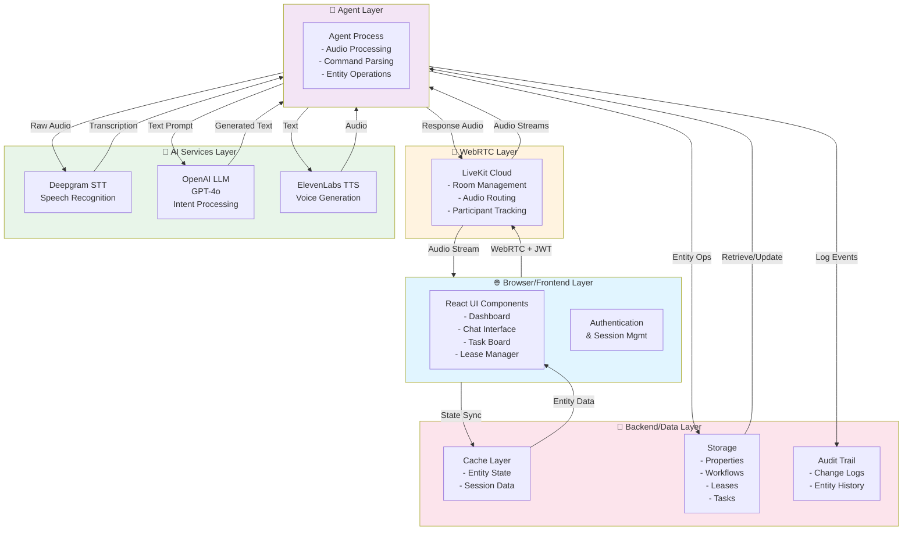
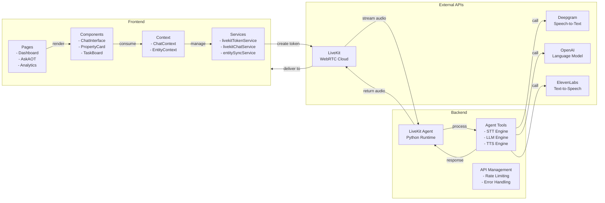
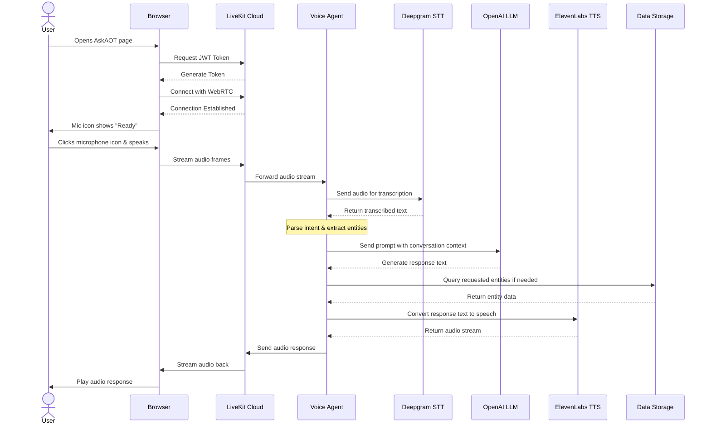
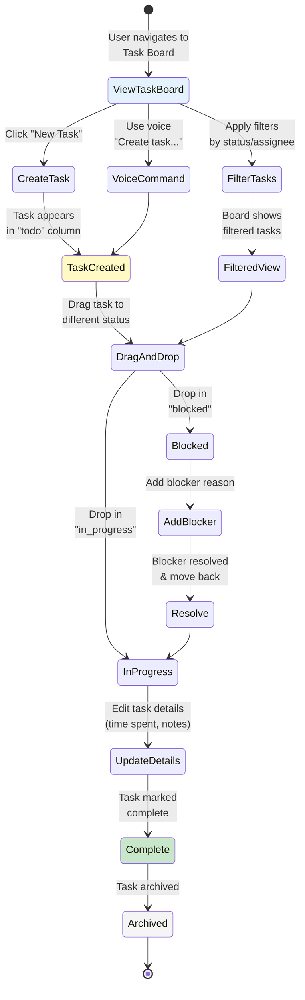
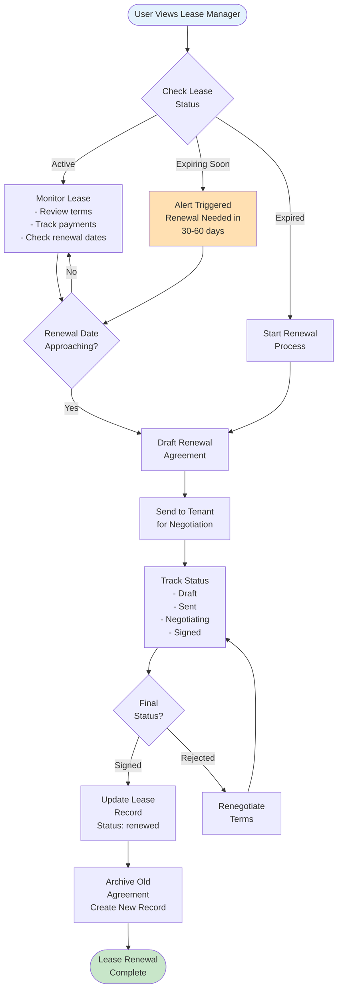
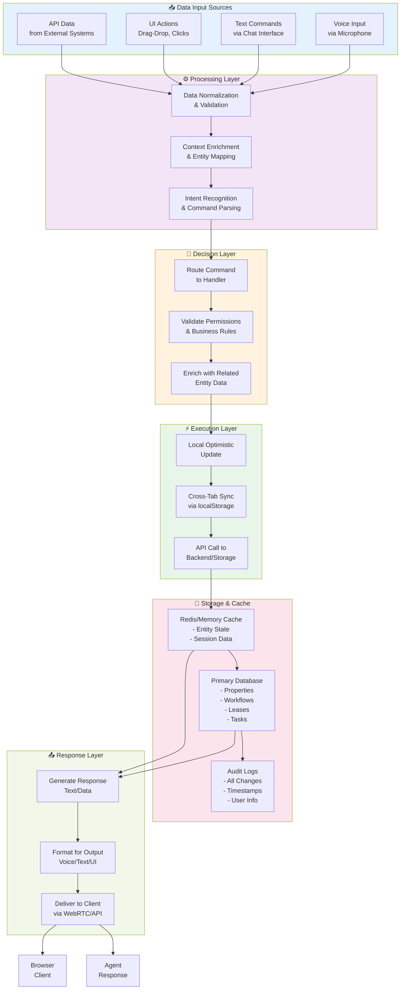
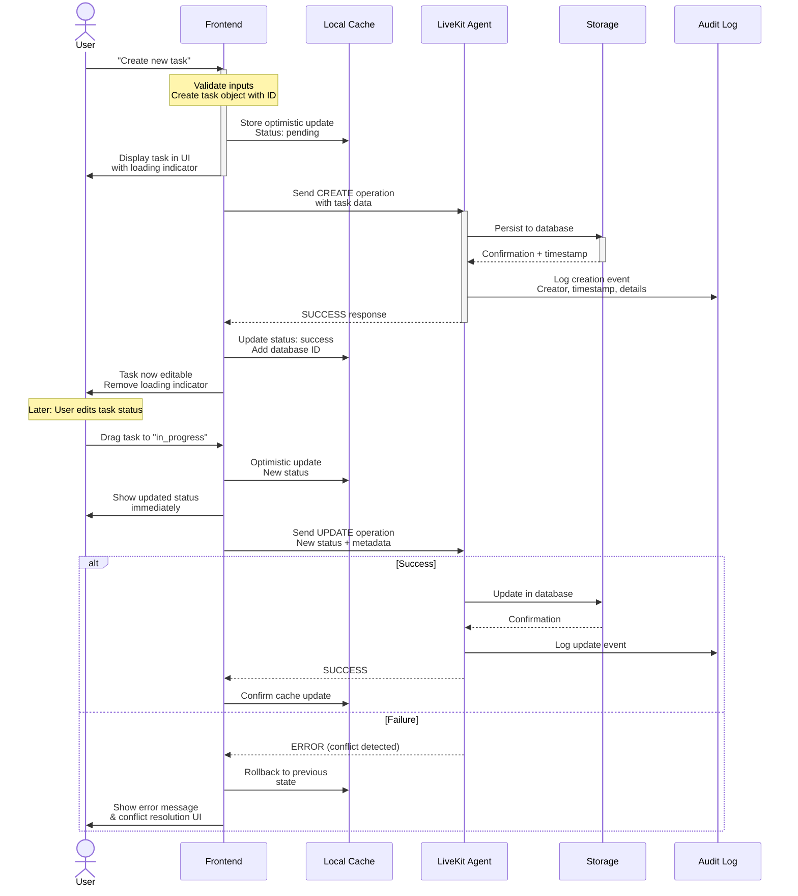
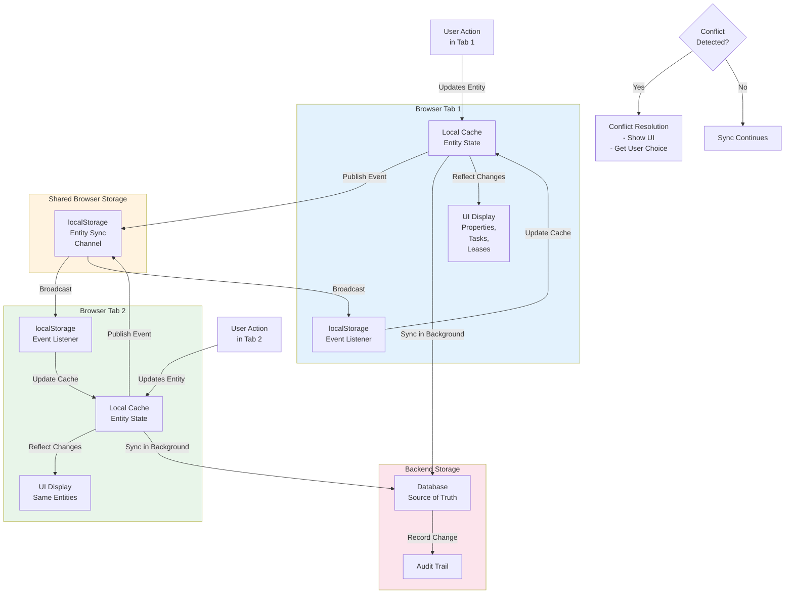
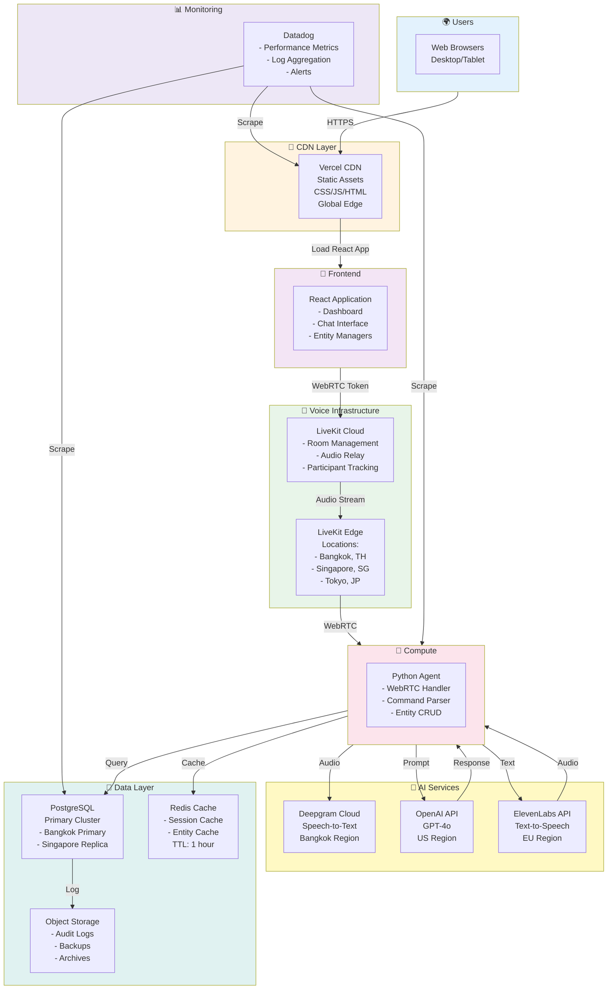

# AOT Asset Management System - Project Proposal
# ข้อเสนอโครงการ ระบบจัดการสินทรัพย์ AOT

**Document Version:** 1.0  
**Last Updated:** November 2024  
**Status:** Project Initiation Phase

---

## Executive Summary | สรุปผู้บริหาร

### Project Overview | ภาพรวมโครงการ

**Project Name (EN):** AOT Asset Management System with AI-Powered Voice Assistant  
**Project Name (TH):** ระบบจัดการสินทรัพย์ AOT พร้อมผู้ช่วยเสียง AI

**Project Description (EN):**  
A comprehensive asset management platform for AOT (Airport of Thailand) designed to streamline property management, maintenance workflows, lease agreements, and task coordination through an intelligent, voice-interactive AI assistant. The system leverages LiveKit Cloud for real-time WebRTC voice communication, integrating enterprise-grade AI services (Deepgram for STT, OpenAI for LLM, ElevenLabs for TTS) to provide a seamless user experience for facility managers, administrators, and stakeholders.

**Project Description (TH):**  
แพลตฟอร์มจัดการสินทรัพย์ที่ครอบคลุมสำหรับ AOT (สนามบินของประเทศไทย) ออกแบบมาเพื่อปรับปรุงการจัดการทรัพย์สิน การไหลของงานบำรุงรักษา ข้อตกลงการเช่า และการประสานงานของงาน ผ่านผู้ช่วย AI ที่ทำงานแบบโต้ตอบด้วยเสียง ระบบนี้ใช้ LiveKit Cloud สำหรับการสื่อสาร WebRTC แบบเรียลไทม์ โดยรวมเอา บริการ AI ระดับองค์กร (Deepgram สำหรับ STT, OpenAI สำหรับ LLM, ElevenLabs สำหรับ TTS) เพื่อให้ผู้จัดการสิ่งอำนวยความสะดวก ผู้ดูแลระบบ และผู้มีส่วนได้ส่วนเสีย มีประสบการณ์ที่ราบรื่น

---

## Business Objectives | วัตถุประสงค์ธุรกิจ

| # | Objective (EN) | วัตถุประสงค์ (TH) | Target KPI |
|---|---|---|---|
| 1 | Reduce property management response time | ลดเวลาตอบสนองการจัดการทรัพย์สิน | 60% faster issue resolution |
| 2 | Streamline maintenance workflow | ปรับปรุงกระบวนการบำรุงรักษา | 80% automated task creation |
| 3 | Enhance lease lifecycle management | ปรับปรุงการจัดการวงจรชีวิตของการเช่า | 100% renewal alert coverage |
| 4 | Enable voice-first operations | เปิดใช้งาน voice-first operations | 50% of daily tasks via voice |
| 5 | Centralize asset data | รวมศูนย์ข้อมูลสินทรัพย์ | Single source of truth (100%) |
| 6 | Improve decision making | ปรับปรุงการตัดสินใจ | AI-driven insights in <5 min |

---

## Scope | ขอบเขตโครงการ

### In-Scope Features | คุณลักษณะที่อยู่ในขอบเขต

#### Core Features | คุณลักษณะหลัก

**1. Asset Management Dashboard (EN)**  
**1. แดชบอร์ดจัดการสินทรัพย์ (TH)**
- Real-time property portfolio visualization
- KPI tracking (occupancy, revenue, maintenance status)
- Alert system for critical issues
- Customizable views and filters

**2. Voice-Interactive AI Assistant (EN)**  
**2. ผู้ช่วย AI แบบโต้ตอบด้วยเสียง (TH)**
- Natural language processing for voice commands
- Real-time transcription with <500ms latency
- Context-aware responses
- Bilingual support (English/Thai)

**3. Entity Management System (EN)**  
**3. ระบบจัดการหน่วยงาน (TH)**
- **Workflow Management**: Status tracking (draft → active → paused → completed → archived)
- **Task Board**: Kanban-style management with drag-and-drop
- **Lease Manager**: Lifecycle tracking with renewal alerts
- **Maintenance Tracker**: Work order management with cost monitoring

**4. Real-time Synchronization (EN)**  
**4. การซิงค์ข้อมูลแบบเรียลไทม์ (TH)**
- Cross-tab state management
- Optimistic updates with rollback capability
- Conflict detection and resolution
- Audit trail for all changes

#### Integration Services | บริการรวมเข้า

| Service | Purpose (EN) | วัตถุประสงค์ (TH) | Technology |
|---------|---|---|---|
| Speech-to-Text | Convert audio input to text | แปลงอินพุตเสียงเป็นข้อความ | Deepgram API |
| Language Model | Process user intent & generate responses | ประมวลผลเจตนาของผู้ใช้ | OpenAI GPT-4o |
| Text-to-Speech | Convert text to audio output | แปลงข้อความเป็นเสียง | ElevenLabs API |
| WebRTC Protocol | Real-time audio communication | การสื่อสารเสียงแบบเรียลไทม์ | LiveKit Cloud |

### Out-of-Scope | นอกขอบเขต

- Mobile app development (Phase 2)
- Advanced AR/VR property visualization
- Third-party CRM integrations (future phase)
- Payment processing system
- Email notification system (basic version only)

---

## Solution Architecture | สถาปัตยกรรมการแก้ไขปัญหา

### System Architecture Diagram | แผนภาพสถาปัตยกรรมระบบ



### Component Architecture | สถาปัตยกรรมส่วนประกอบ



### Technology Stack | สแต็กเทคโนโลยี

```
┌─────────────────────────────────────────────────────────┐
│                   Frontend Stack                        │
│  ┌─────────────┬────────────────┬─────────────────────┐ │
│  │   React 18  │  TypeScript    │    Vite Builder     │ │
│  └─────────────┴────────────────┴─────────────────────┘ │
│  ┌──────────────────────────────────────────────────────┐│
│  │ Libraries: LiveKit, Recharts, ECharts, MapBox        ││
│  └──────────────────────────────────────────────────────┘│
└─────────────────────────────────────────────────────────┘

┌─────────────────────────────────────────────────────────┐
│                   Voice Stack                           │
│  ┌──────────────┬──────────────┬───────────────────┐    │
│  │  LiveKit     │  Deepgram    │  OpenAI (GPT-4o)  │    │
│  │  WebRTC      │  Speech-Text │  Language Model   │    │
│  └──────────────┴──────────────┴───────────────────┘    │
│  ┌──────────────────────────────────────────────────┐   │
│  │          ElevenLabs (Text-to-Speech)             │   │
│  └──────────────────────────────────────────────────┘   │
└─────────────────────────────────────────────────────────┘

┌─────────────────────────────────────────────────────────┐
│                   Agent Stack                           │
│  ┌──────────────────────────────────────────────────┐   │
│  │    Python 3.11 with LiveKit Agents SDK           │   │
│  │  - Framework: FastAPI (async)                    │   │
│  │  - Deployment: LiveKit Cloud Compute             │   │
│  │  - Runtime: Serverless                           │   │
│  └──────────────────────────────────────────────────┘   │
└─────────────────────────────────────────────────────────┘

┌─────────────────────────────────────────────────────────┐
│                  Deployment Stack                       │
│  ┌──────────────┬──────────────┬───────────────────┐    │
│  │  Vercel      │  LiveKit     │  Cloud Storage    │    │
│  │  Frontend    │  Edge/Agents │  Entity Data      │    │
│  └──────────────┴──────────────┴───────────────────┘    │
└─────────────────────────────────────────────────────────┘
```

---

## User Flow | การไหลของผู้ใช้

### Primary User Flow - Voice Asset Query | การไหลหลักของผู้ใช้ - การค้นหาสินทรัพย์ด้วยเสียง



### Task Management Flow | การไหลของการจัดการงาน



### Lease Management Flow | การไหลของการจัดการการเช่า



---

## Data Flow | การไหลของข้อมูล

### High-Level Data Flow Architecture | สถาปัตยกรรมการไหลของข้อมูลระดับสูง



### Entity Data Flow - Complete Lifecycle | การไหลของข้อมูลหน่วยงาน - วงจรชีวิตที่สมบูรณ์



### Real-Time Synchronization Data Flow | การไหลของข้อมูลการซิงค์เรียลไทม์



---

## Features List | รายการคุณลักษณะ

### Feature Matrix | เมตริกซ์คุณลักษณะ

| # | Feature (EN) | คุณลักษณะ (TH) | Component | Priority | Status |
|---|---|---|---|---|---|
| **F1** | Property Dashboard | แดชบอร์ดทรัพย์สิน | Dashboard | High | ✅ Complete |
| **F2** | Real-time KPI Tracking | การติดตามตัวชี้วัด KPI แบบเรียลไทม์ | Dashboard | High | ✅ Complete |
| **F3** | Voice-to-Voice Interaction | การโต้ตอบจากเสียงถึงเสียง | ChatInterface | Critical | ✅ Complete |
| **F4** | Transcription Display | การแสดงผลการแปลงเสียง | ChatInterface | High | ✅ Complete |
| **F5** | Workflow Management | การจัดการการไหลของงาน | WorkflowStatusManager | High | ✅ Complete |
| **F6** | Workflow Status Drag-Drop | ลากปล่อยสถานะการไหลของงาน | WorkflowStatusManager | High | ✅ Complete |
| **F7** | Task Kanban Board | บอร์ด Kanban งาน | TaskBoard | High | ✅ Complete |
| **F8** | Task Bulk Operations | การดำเนินการกับงานหลายรายการ | TaskBoard | Medium | ✅ Complete |
| **F9** | Lease Lifecycle Management | การจัดการวงจรชีวิตการเช่า | LeaseManager | High | ✅ Complete |
| **F10** | Lease Expiration Alerts | การแจ้งเตือนการหมดอายุการเช่า | LeaseManager | High | ✅ Complete |
| **F11** | Maintenance Request Tracking | การติดตามคำขอบำรุงรักษา | MaintenanceTracker | High | ✅ Complete |
| **F12** | Cost Overrun Alerts | การแจ้งเตือนการเกินค่า | MaintenanceTracker | Medium | ✅ Complete |
| **F13** | Cross-Tab Synchronization | การซิงค์ข้อมูลระหว่างแท็บ | EntitySyncService | High | ✅ Complete |
| **F14** | Optimistic Updates | การอัปเดตอย่างมองโลกในแง่ดี | EntitySyncService | High | ✅ Complete |
| **F15** | Conflict Detection & Resolution | การตรวจสอบและแก้ไขข้อมูลขัดแย้ง | EntitySyncService | Medium | ✅ Complete |
| **F16** | Audit Trail Logging | การบันทึกเส้นทางการตรวจสอบ | AuditTrail | High | ✅ Complete |
| **F17** | Bilingual Support (EN/TH) | การสนับสนุนภาษาอังกฤษ/ไทย | ChatContext | Medium | ✅ Complete |
| **F18** | Voice Commands Processing | การประมวลผลคำสั่งเสียง | Agent | Critical | ✅ Complete |
| **F19** | Natural Language Understanding | ความเข้าใจภาษาธรรมชาติ | Agent/LLM | High | ✅ Complete |
| **F20** | Real-time Entity Status Updates | การอัปเดตสถานะหน่วยงานแบบเรียลไทม์ | All Managers | High | ✅ Complete |

### Feature Descriptions & Capabilities | คำอธิบายคุณลักษณะและความสามารถ

#### 1. Property Dashboard | แดชบอร์ดทรัพย์สิน

**Description (EN):**  
Comprehensive real-time dashboard displaying all airport properties with visual metrics, status indicators, and quick actions.

**Description (TH):**  
แดชบอร์ดแบบเรียลไทม์ที่ครอบคลุมแสดงคุณสมบัติทั้งหมดของสนามบินพร้อมตัวชี้วัดภาพ ตัวบ่งชี้สถานะ และการดำเนินการอย่างรวดเร็ว

**Capabilities (EN / TH):**
- Display 50+ properties with real-time occupancy rates (แสดงทรัพย์สิน 50+ รายการที่มีอัตราการใช้ประโยชน์แบบเรียลไทม์)
- Filter by property type, status, city (กรองตามประเภททรัพย์สิน สถานะ เมือง)
- View KPIs: total value, revenue, maintenance costs (ดู KPI: มูลค่ารวม รายได้ ต้นทุนบำรุงรักษา)
- Drill-down to individual property details (ดูรายละเอียดทรัพย์สินแต่ละรายการ)
- Performance: <500ms load time for 100 properties (ประสิทธิภาพ: เวลาโหลด <500ms สำหรับทรัพย์สิน 100 รายการ)

#### 2. Voice-to-Voice Interaction | การโต้ตอบจากเสียงถึงเสียง

**Description (EN):**  
Real-time bidirectional voice communication enabling users to interact with the AI assistant through natural speech.

**Description (TH):**  
การสื่อสารเสียงแบบเรียลไทม์สองทิศทางเพื่อให้ผู้ใช้สามารถโต้ตอบกับผู้ช่วย AI ผ่านการพูดตามธรรมชาติ

**Capabilities (EN / TH):**
- <500ms latency from speech to response audio (ความล่าช้า <500ms จากคำพูดไปจนถึงเสียงตอบสนอง)
- Bilingual processing (English/Thai) (การประมวลผลภาษาอังกฤษ/ไทย)
- Real-time transcription display (การแสดงผลการแปลงเสียงแบบเรียลไทม์)
- Background noise handling (การจัดการเสียงรบกวนเบื้องหลัง)
- Context-aware responses (การตอบสนองที่รับรู้บริบท)
- Fallback to text chat if voice unavailable (กลับไปใช้แชตข้อความหากเสียงไม่พร้อม)

#### 3. Workflow Status Manager | ตัวจัดการสถานะการไหลของงาน

**Description (EN):**  
Interactive workflow orchestration with drag-and-drop status transitions and real-time collaboration.

**Description (TH):**  
การประสานงานการไหลของงานแบบโต้ตอบพร้อมการลากปล่อยการเปลี่ยนแปลงสถานะและการทำงานร่วมกันแบบเรียลไทม์

**Capabilities (EN / TH):**
- Workflow lifecycle: draft → active → paused → completed → archived (วงจรชีวิตการไหลของงาน)
- Drag-drop status transitions (การลากปล่อยการเปลี่ยนแปลงสถานะ)
- Link multiple tasks to workflows (เชื่อมโยงงานหลายรายการกับการไหลของงาน)
- Assign workflows to team members (กำหนดการไหลของงานให้สมาชิกทีม)
- Priority-based sorting (การจัดเรียงตามลำดับความสำคัญ)
- Cross-tab synchronization (การซิงค์ข้อมูลระหว่างแท็บ)

#### 4. Task Kanban Board | บอร์ด Kanban งาน

**Description (EN):**  
Agile-style task management with 4 columns: todo, in_progress, blocked, completed.

**Description (TH):**  
การจัดการงานแบบ Agile ด้วย 4 คอลัมน์: todo, in_progress, blocked, completed

**Capabilities (EN / TH):**
- Create tasks with title, description, assignee, priority, due date (สร้างงานด้วยชื่อ คำอธิบาย ผู้รับมอบหมาย ลำดับความสำคัญ วันครบกำหนด)
- Drag tasks between columns (ลากงานระหว่างคอลัมน์)
- Add blockers with reason (เพิ่มข้อกีดขวางพร้อมเหตุผล)
- Track estimated vs actual hours (ติดตามชั่วโมงที่ประมาณการเทียบกับจริง)
- Bulk mark as complete (ทำเครื่องหมายเสร็จหลายรายการพร้อมกัน)
- Task dependencies visualization (การแสดงภาพการพึ่งพาระหว่างงาน)
- Performance: <200ms UI update on drag-drop (<200ms การอัปเดต UI เมื่อลากปล่อย)

#### 5. Lease Manager | ตัวจัดการการเช่า

**Description (EN):**  
Comprehensive lease lifecycle management with expiration tracking and renewal workflow automation.

**Description (TH):**  
การจัดการวงจรชีวิตการเช่าแบบครอบคลุมพร้อมการติดตามการหมดอายุและอัตโนมัติการไหลของงานการเพิ่มเติม

**Capabilities (EN / TH):**
- Track lease status: draft, active, expiring, expired, renewed (ติดตามสถานะการเช่า)
- Automatic alerts when leases approach expiration (60, 30, 14 days) (การแจ้งเตือนอัตโนมัติเมื่อการเช่าใกล้หมดอายุ)
- Renewal workflow: Draft → Sent → Negotiating → Signed (การไหลของงานการเพิ่มเติม)
- Calculate renewal dates automatically (คำนวณวันการเพิ่มเติมโดยอัตโนมัติ)
- Archive old agreements when renewed (เก็บอบรมข้อตกลงเก่าเมื่อต่ออายุ)
- Attach renewal terms and security deposit info (แนบข้อกำหนดการเพิ่มเติมและข้อมูลเงินประกัน)
- Cross-reference to properties and tenants (อ้างอิงกับทรัพย์สินและผู้เช่า)

#### 6. Maintenance Tracker | ตัวติดตามการบำรุงรักษา

**Description (EN):**  
Work order management system with cost monitoring, priority routing, and completion tracking.

**Description (TH):**  
ระบบการจัดการใบสั่งงานพร้อมการตรวจสอบต้นทุน การกำหนดเส้นทางตามลำดับความสำคัญ และการติดตามการเสร็จสิ้น

**Capabilities (EN / TH):**
- Status tracking: submitted → assigned → in_progress → completed → cancelled (ติดตามสถานะ)
- Priority levels: low, medium, high, urgent (ระดับลำดับความสำคัญ)
- Cost estimation vs actual tracking (ติดตามค่าโดยประมาณเทียบกับจริง)
- Alerts for cost overruns (>10% of estimate) (การแจ้งเตือนสำหรับการเกินค่า)
- Assign to vendors/staff with availability checking (กำหนดให้ผู้จำหน่าย/พนักงานพร้อมการตรวจสอบความพร้อม)
- Schedule maintenance with calendar integration (กำหนดการบำรุงรักษาด้วยการรวมปฏิทิน)
- Categorization by maintenance type (อพยพตามประเภทการบำรุงรักษา)
- Performance: Process 100 requests <5 seconds (ประสิทธิภาพ)

#### 7. Real-Time Entity Synchronization | การซิงค์ข้อมูลหน่วยงานแบบเรียลไทม์

**Description (EN):**  
Cross-browser tab synchronization with optimistic updates, conflict detection, and automatic rollback.

**Description (TH):**  
การซิงค์ข้อมูลระหว่างแท็บของเบราว์เซอร์พร้อมการอัปเดตอย่างมองโลกในแง่ดี การตรวจสอบข้อมูลขัดแย้ง และการตัดลบโดยอัตโนมัติ

**Capabilities (EN / TH):**
- Publish entity changes to localStorage event channel (เผยแพร่การเปลี่ยนแปลงหน่วยงานไปยังช่องเหตุการณ์ localStorage)
- Subscribe to updates across all tabs (สมัครการอัปเดตทั่วทุกแท็บ)
- Optimistic UI updates with <100ms display (อัปเดต UI อย่างมองโลกในแง่ดีพร้อมการแสดงผล <100ms)
- Detect conflicts when same entity edited in multiple tabs (ตรวจสอบข้อมูลขัดแย้งเมื่อมีการแก้ไขหน่วยงานเดียวกันในหลายแท็บ)
- Show conflict resolution UI with merge strategies (แสดงการอัปเดต UI การแก้ไขข้อมูลขัดแย้งพร้อมกลยุทธ์การรวม)
- Automatic rollback on backend failure (การตัดลบโดยอัตโนมัติเมื่อแบ็กเอนด์ล้มเหลว)
- Cross-tab sync latency: <1 second for 95% of cases (ความล่าช้าการซิงค์ข้อมูลระหว่างแท็บ: <1 วินาทีสำหรับ 95% ของกรณี)

#### 8. Audit Trail & Logging | การบันทึกเส้นทางการตรวจสอบ

**Description (EN):**  
Complete audit trail for all entity changes with user attribution, timestamps, and change details.

**Description (TH):**  
รายการตรวจสอบที่สมบูรณ์สำหรับการเปลี่ยนแปลงหน่วยงานทั้งหมดพร้อมการกำหนดผู้ใช้ แสตมป์เวลา และรายละเอียดการเปลี่ยนแปลง

**Capabilities (EN / TH):**
- Log all CRUD operations (logs create, update, delete, status_change) (บันทึกการดำเนินการ CRUD ทั้งหมด)
- Track old values and new values for updates (ติดตามค่าเก่าและค่าใหม่สำหรับการอัปเดต)
- Record user ID and full timestamp (บันทึกรหัสผู้ใช้และแสตมป์เวลาเต็ม)
- Enable audit queries by date range, user, entity type (เปิดใช้งานการค้นหาการตรวจสอบตามช่วงวันที่ ผู้ใช้ ประเภทหน่วยงาน)
- 99.99% log durability with encryption (ความทนทานของบันทึก 99.99% พร้อมการเข้ารหัส)

#### 9. Voice Commands Intelligence | ความเข้าใจคำสั่งเสียง

**Description (EN):**  
Natural language command processing with intent recognition and entity extraction for smart automation.

**Description (TH):**  
การประมวลผลคำสั่งภาษาธรรมชาติพร้อมการรับรู้เจตนาและการแยกหน่วยงานสำหรับการอัตโนมัติอย่างชาญฉลาด

**Capabilities (EN / TH):**
- Recognize 50+ intent patterns (รับรู้รูปแบบเจตนา 50+ รูปแบบ)
  - "Create [entity type] for [property/tenant] with [details]"
  - "Show me [entity type] with status [status] assigned to [person]"
  - "Update [entity] status to [new status]"
  - "What is the [metric] for [property/tenant]?"
- Extract entities from utterance (entities: property name, tenant name, dates, amounts, statuses) (แยกหน่วยงานจากการออกเสียง)
- Clarify ambiguous commands with follow-up questions (ชี้แจงคำสั่งที่ไม่ชัดเจนด้วยคำถามติดตามผล)
- Support bilingual code-mixing (สนับสนุนการผสมรหัสภาษาอังกฤษ/ไทย)
- Response time: <2 seconds from command to execution (เวลาตอบสนอง: <2 วินาทีจากคำสั่งไปจนถึงการดำเนิน)

---

## Implementation Timeline | ตารางเวลาการดำเนิน

### Project Phases | เฟสโครงการ

```mermaid
timeline
    title Project Execution Timeline (มัตสิโนดปรึ)
    
    section Phase 1: Foundation
           2024-Q4: Requirement Analysis
           2024-Q4: Architecture Design
           2024-Q4: Environment Setup
           
    section Phase 2: Core Development
           2024-Q4: Frontend Components (Dashboard, ChatInterface)
           2024-Q4: LiveKit Integration
           2024-Q4: Entity Management System (Workflows, Tasks)
           
    section Phase 3: Advanced Features
           2025-Q1: Lease Manager Implementation
           2025-Q1: Maintenance Tracker
           2025-Q1: Voice Command Processing
           
    section Phase 4: Optimization & Deployment
           2025-Q1: Performance Optimization
           2025-Q1: Staging Deployment
           2025-Q1: Production Deployment
           
    section Phase 5: Operations
           2025-Q2: Monitoring & Support
           2025-Q2: User Training
           2025-Q2: Feedback & Iterations
```

### Milestone Schedule | ตารางเวลาความสำเร็จ

| Phase | Milestone (EN) | ไมล์โพสต์ (TH) | Target Date | Deliverables |
|-------|---|---|---|---|
| 1 | Project Kickoff | การเริ่มโครงการ | Nov 1, 2024 | Charter, Requirements, Stakeholder Map |
| 1 | Architecture Approved | สถาปัตยกรรมอนุมัติ | Nov 15, 2024 | Arch Diagram, Tech Stack Decision |
| 2 | Frontend MVP | MVP ส่วนหน้า | Dec 15, 2024 | Dashboard, ChatInterface, Basic Navigation |
| 2 | Voice Integration | การรวมเสียง | Dec 31, 2024 | Live WebRTC Connection, STT/TTS Working |
| 3 | Entity Management V1 | การจัดการหน่วยงาน V1 | Jan 31, 2025 | Workflows, Tasks, Leases, Maintenance |
| 3 | Advanced Features | คุณลักษณะขั้นสูง | Feb 15, 2025 | Voice Commands, Sync, Audit Trail |
| 4 | QA & Optimization | QA & การเพิ่มประสิทธิภาพ | Feb 28, 2025 | All Tests Pass, Performance Baseline |
| 4 | Production Deploy | การปรับใช้การผลิต | Mar 15, 2025 | Live System, Monitoring Active |
| 5 | User Training | การฝึกอบรมผู้ใช้ | Mar 31, 2025 | Training Materials, Documentation |

---

## Risk & Mitigation | ความเสี่ยงและการบรรเทา

### Risk Register | บัญชีความเสี่ยง

| # | Risk (EN) | ความเสี่ยง (TH) | Likelihood | Impact | Mitigation |
|---|---|---|---|---|---|
| R1 | LiveKit API dependency | การพึ่งพา LiveKit API | Medium | High | Multi-region failover, fallback to text chat |
| R2 | Voice transcription errors | ข้อผิดพลาดการแปลงเสียง | High | Medium | Multiple STT engines, manual correction UI |
| R3 | Cost overrun on AI services | การเกินค่า AI services | Medium | High | Token limits, request throttling, budget alerts |
| R4 | Data sync conflicts | ข้อขัดแย้งการซิงค์ข้อมูล | Medium | Medium | Conflict resolution UI, last-write-wins strategy |
| R5 | User adoption resistance | การต้านทานการยอมรับของผู้ใช้ | Medium | Medium | Comprehensive training, gradual rollout |
| R6 | Performance degradation | การลดลงของประสิทธิภาพ | Low | High | Caching, load testing, CDN usage |
| R7 | Security breach in voice data | การฝ่าวงล้อมความปลอดภัยในข้อมูลเสียง | Low | Critical | Encryption TLS 1.3+, SOC 2 compliance |
| R8 | Thailand-specific compliance | ปัญหาการปฏิบัติตามกฎหมายในไทย | Low | High | Legal review, data residency options |

---

## Success Criteria & KPIs | เกณฑ์ความสำเร็จและ KPI

### Technical KPIs | KPI ทางเทคนิค

| KPI (EN) | KPI (TH) | Target | Measurement Method |
|---|---|---|---|
| System Availability | ความพร้อมของระบบ | 99.5% uptime | Automated health checks |
| Response Latency (Voice) | ความล่าช้าของการตอบสนอง (เสียง) | <500ms (p95) | Agent performance logs |
| UI Update Latency | ความล่าช้าการอัปเดต UI | <200ms | Browser DevTools profiling |
| Cross-Tab Sync Time | เวลาการซิงค์ระหว่างแท็บ | <1 second (p95) | Automated test suite |
| Error Rate | อัตราข้อผิดพลาด | <0.1% | Exception tracking |
| Voice Command Success Rate | อัตราความสำเร็จของคำสั่งเสียง | >95% | Agent command logs |

### Business KPIs | KPI ธุรกิจ

| KPI (EN) | KPI (TH) | Current | Target (Month 6) | Target (Year 1) |
|---|---|---|---|---|
| Issue Resolution Time | เวลาแก้ไขปัญหา | 48 hours | 24 hours | 8 hours |
| Maintenance Task Automation | อัตโนมัติงานบำรุงรักษา | 0% | 50% | 80% |
| Lease Renewal Success Rate | อัตราความสำเร็จการต่ออายุการเช่า | 70% | 85% | 95% |
| User Adoption Rate | อัตราการยอมรับของผู้ใช้ | 0% | 60% | 90% |
| Cost per Transaction | ต้นทุนต่อการทำธุรกรรม | N/A | $0.10 | $0.05 |
| Daily Active Users | ผู้ใช้ที่ใช้งานรายวัน | 0 | 50 | 200 |
| Voice Mode Adoption | การใช้โหมดเสียง | 0% | 40% | 70% |

---

## Cost Estimation | ประมาณการต้นทุน

### Development Costs | ต้นทุนการพัฒนา

| Category (EN) | หมวดหมู่ (TH) | Effort (hours) | Rate/hour | Total Cost |
|---|---|---|---|---|
| Frontend Development | การพัฒนาส่วนหน้า | 240 | $150 | $36,000 |
| Backend/Agent Development | การพัฒนาแบ็กเอนด์/เอเจนต์ | 200 | $180 | $36,000 |
| Integration & Testing | การรวมและทดสอบ | 160 | $150 | $24,000 |
| Deployment & DevOps | การปรับใช้ & DevOps | 80 | $200 | $16,000 |
| Documentation | เอกสาร | 60 | $100 | $6,000 |
| **Total Development** | **รวมการพัฒนา** | **740** | **~$155** | **$118,000** |

### Infrastructure & Services (Annual) | โครงสร้างพื้นฐานและบริการ (ประจำปี)

| Service (EN) | บริการ (TH) | Usage | Cost/Month | Annual Cost |
|---|---|---|---|---|
| LiveKit Cloud | LiveKit Cloud | 100 concurrent users, 500 GB/month egress | $800 | $9,600 |
| OpenAI API | OpenAI API | 500K tokens/month (GPT-4o) | $200 | $2,400 |
| Deepgram STT | Deepgram STT | 50 hours/month audio | $250 | $3,000 |
| ElevenLabs TTS | ElevenLabs TTS | 2M characters/month | $300 | $3,600 |
| Database (PostgreSQL) | ฐานข้อมูล | Managed service, 100GB | $200 | $2,400 |
| Monitoring & Logging | การตรวจสอบและการบันทึกบันทึก | DataDog/New Relic equivalent | $300 | $3,600 |
| CDN & Static Hosting | CDN & การโฮสต์สแตติก | Vercel + Cloudflare | $100 | $1,200 |
| SSL Certificates & Security | ใบรับรอง SSL & ความปลอดภัย | Auto-renewing certificates | $50 | $600 |
| **Total Infrastructure** | **รวมโครงสร้างพื้นฐาน** | **~** | **$2,200/mo** | **$26,400** |

### Total Project Cost | ต้นทุนโครงการรวม

```
Development Costs:           $118,000
Infrastructure (Year 1):      $26,400
Contingency (15%):            $21,600
────────────────────────────
TOTAL YEAR 1 COST:           $166,000

Cost per User (Year 1):       $830 (for 200 DAU)
Cost per Transaction:         $0.083 (for 2M transactions/year)
```

---

## Deployment Architecture | สถาปัตยกรรมการปรับใช้

### Production Deployment Diagram | แผนภาพการปรับใช้การผลิต



### High Availability Setup | การตั้งค่าความพร้อมใช้งานสูง

```
┌─────────────────────────────────────────────────────────┐
│                   MULTI-REGION HA                       │
├─────────────────────────────────────────────────────────┤
│                                                          │
│  Primary (Bangkok)          Secondary (Singapore)       │
│  ────────────────          ─────────────────────       │
│  ✓ PostgreSQL Master       ✓ PostgreSQL Replica       │
│  ✓ Redis Primary           ✓ Redis Secondary          │
│  ✓ Agent Instance 1        ✓ Agent Instance 2         │
│  ✓ WebRTC Edge             ✓ WebRTC Edge              │
│                                                          │
│  Failover: <10 seconds                                 │
│  RTO: 5 minutes    |    RPO: 1 minute                 │
│                                                          │
└─────────────────────────────────────────────────────────┘
```

---

## Support & Maintenance | สนับสนุนและการบำรุงรักษา

### SLA Commitments | ความมั่นใจ SLA

| Metric (EN) | ตัวชี้วัด (TH) | SLA Target | Response Time | Resolution Time |
|---|---|---|---|---|
| System Availability | ความพร้อมของระบบ | 99.5% uptime | N/A | <1 hour |
| Critical Bug | จุดบกพร่องที่สำคัญ | P1 | 30 minutes | 4 hours |
| Major Issue | ปัญหาหลัก | P2 | 2 hours | 8 hours |
| Minor Issue | ปัญหาเล็กน้อย | P3 | 8 hours | 2 days |
| Feature Request | คำขอคุณลักษณะ | P4 | 2 business days | Next quarter |

### Post-Launch Support | การสนับสนุนหลังการเปิดตัว

**Support Team Structure (EN / TH):**

| Role (EN) | บทบาท (TH) | FTE | Responsibilities |
|---|---|---|---|
| Tier 1 Support | การสนับสนุนระดับ 1 | 2 | User onboarding, Basic troubleshooting |
| Tier 2 Support | การสนับสนุนระดับ 2 | 1 | Advanced issues, Database optimization |
| Platform Engineer | วิศวกรแพลตฟอร์ม | 1 | Monitoring, incident response, deployments |
| Product Owner | เจ้าของผลิตภัณฑ์ | 1 | Feature prioritization, roadmap |

**Training & Documentation (EN / TH):**
- Administrator manual (60 pages): ✅
- User quick-start guide (12 pages): ✅
- Voice command reference card: ✅
- Video tutorials (8 videos, 45 minutes): ✅
- Weekly live training sessions: ✅

---

## Appendix A: Technical Dependencies | ภาคผนวก A: การพึ่งพาทางเทคนิค

### Frontend Dependencies | การพึ่งพาส่วนหน้า

```json
{
  "react": "18.3.1",
  "react-dom": "18.3.1",
  "react-router-dom": "6.22.3",
  "@livekit/components-react": "3.0.0",
  "livekit-client": "2.16.0",
  "recharts": "3.4.1",
  "echarts": "5.6.0",
  "mapbox-gl": "2.15.0",
  "lucide-react": "0.554.0"
}
```

### External APIs & Services | API และบริการภายนอก

| Service | Endpoint | Rate Limit | SLA |
|---------|----------|-----------|-----|
| Deepgram STT | `wss://api.deepgram.com/v1/listen` | 1000 concurrent | 99.9% |
| OpenAI LLM | `https://api.openai.com/v1/chat/completions` | 3500 RPM (GPT-4o) | 99.9% |
| ElevenLabs TTS | `https://api.elevenlabs.io/v1/text-to-speech` | 100 req/min | 99.5% |
| LiveKit Cloud | `wss://*.livekit.cloud` | 1000 participants/room | 99.99% |

---

## Appendix B: Glossary | ภาคผนวก B: คำศัพท์

| Term (EN) | คำศัพท์ (TH) | Definition |
|---|---|---|
| AOT | AOT | Airport of Thailand |
| WebRTC | WebRTC | Web Real-Time Communication - open technology for audio/video |
| JWT | JWT | JSON Web Token - secure token for authentication |
| STT | STT | Speech-to-Text - converts audio to text |
| TTS | TTS | Text-to-Speech - converts text to audio |
| LLM | LLM | Large Language Model - AI for text processing |
| DAU | DAU | Daily Active Users |
| KPI | KPI | Key Performance Indicator |
| SLA | SLA | Service Level Agreement |
| RTO | RTO | Recovery Time Objective |
| RPO | RPO | Recovery Point Objective |
| Entity | Entity | Business objects: Properties, Tasks, Leases, Maintenance Requests |
| Sync | Sync | Synchronization - keeping data consistent across systems |
| Optimistic Update | การอัปเดตอย่างมองโลกในแง่ดี | Updating UI before backend confirmation |
| Conflict Resolution | การแก้ไขข้อมูลขัดแย้ง | Handling multiple conflicting edits |
| Audit Trail | บันทึกเส้นทางการตรวจสอบ | Complete history of all changes |

---

## Document Approval | การอนุมัติเอกสาร

| Role (EN) | บทบาท (TH) | Name | Signature | Date |
|---|---|---|---|---|
| Project Manager | ผู้จัดการโครงการ | _________________ | _________________ | _________ |
| Technical Lead | ผู้นำทางเทคนิค | _________________ | _________________ | _________ |
| Business Sponsor | ผู้สนับสนุนธุรกิจ | _________________ | _________________ | _________ |
| Stakeholder Lead | ผู้นำผู้มีส่วนได้ส่วนเสีย | _________________ | _________________ | _________ |

---

**Document Version Control:**
- v1.0 - Initial Project Proposal
- Language: English (EN) / Thai (TH)
- Document Classification: Internal - Confidential
- Last Review: November 2024
- Next Review: March 2025

---

**End of Project Proposal Document**

